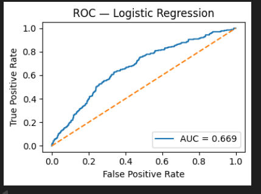
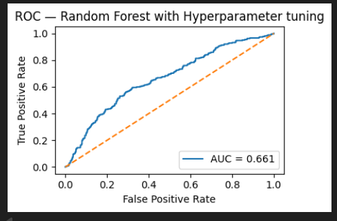
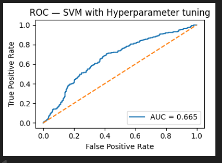

# This repo contains Practical Assignment for Evaluation.

## 1. Introduction – Business Problem Overview

**ConnectMe**, a leading telecom service provider, is currently facing two major business challenges that directly impact its revenue and market share:

### 1. Customer Churn
A significant portion of existing customers are leaving for competitors. Retaining customers is critical because acquiring new ones is far more expensive than keeping current ones. The company needs a way to identify customers at high risk of leaving so it can take proactive measures, such as offering tailored discounts or improved service packages.

### 2. Revenue Optimization
Beyond retaining customers, ConnectMe wants to maximize revenue by predicting how much a customer is likely to spend each month. Accurate forecasts of monthly charges enable better financial planning, targeted marketing campaigns, and personalized service tiers.

---

This project addresses **both** of these challenges by leveraging **Machine Learning** techniques on a unified customer dataset.

The work is split into two predictive tasks:

- **Classification Task** – Predict whether a customer will churn in the near future.
- **Regression Task** – Predict the expected monthly spending of a customer.

The outcomes of these models can directly guide **retention strategies** and **revenue growth initiatives**, enabling ConnectMe to remain competitive in a saturated telecom market.

## 2. Data Insights from Exploratory Data Analysis (EDA)
- **Customer Demographics**: Factors like age, having a partner, or dependents don’t strongly affect whether customers stay or leave—churn rates are similar across these groups. However, customers with a partner but no dependents are slightly more likely to leave and tend to have higher bills, offering a specific group to target with retention offers.

- **Service Usage**: Customers without add-on services like online security, backup, device protection, or tech support are more likely to leave, suggesting these services make customers feel more valued and loyal. Those without phone service or multiple lines also show slightly higher churn, and customers with DSL internet leave more often than those with fiber or no internet. Lack of streaming services (TV or movies) also ties to higher churn, indicating these features may encourage customers to stay.

- **Contract and Tenure**: Customers on month-to-month contracts are far more likely to leave (44.8% churn) compared to those on two-year contracts (21.2%), showing that longer commitments help keep customers. New customers in their first year are at high risk of leaving (42%), but this risk drops significantly after two years (18–21%), highlighting the need to focus retention efforts on newer customers.

- **Billing and Payments**: Whether customers use paperless billing or specific payment methods doesn’t strongly influence whether they stay or their spending, suggesting these aren’t major factors in customer decisions.

- **Monthly Charges**: Customer bills stay consistent across most services, age groups, and time with the company, with no major changes. However, customers bundling all six internet services pay less, likely due to discounts.

- **Key Takeaways**: To reduce customer loss, ConnectMe should encourage longer contracts, promote add-on services like security and streaming, and focus on supporting new customers early on. The stable billing patterns provide a foundation for refining pricing strategies to maximize revenue, with a focus on bundled offerings to attract and retain customers.

## 3.1 Model Performance – Classification Task 

The classification models were trained using the **selected_features_1** subset:
`['Tenure_(12-month_groups)', 'Contract', 'InternetService_No', 'Partner', 'InternetService_Fiber optic', 'PaymentMethod_Bank transfer (automatic)', 'PaymentMethod_Mailed check', 'TotalInternetServicesUsed', 'MonthlyCharges']`

Performance was evaluated using **Accuracy**, **Precision**, **Recall**, **F1-Score**, and **ROC AUC**.

| Model                          | Accuracy | ROC AUC | Precision (Churn=1) | Recall (Churn=1) | F1-Score (Churn=1) |
|--------------------------------|----------|---------|----------------------|------------------|--------------------|
| Logistic Regression            | 0.646    | 0.6687  | 0.3957               | **0.6298**       | 0.4860             |
| Random Forest (Tuned)          | 0.699    | 0.6606  | 0.4330               | 0.4313           | 0.4321             |
| SVM (Tuned)                     | 0.618    | 0.6654  | 0.3814               | 0.7061           | 0.4953             |

---

### ROC Curve Visualization
Below are the ROC curves for the classification models:

---

### Business Perspective
- **Logistic Regression** offers the most balanced trade-off between **recall and interpretability** for identifying churners, with a strong recall of **62.98%**.
- **SVM** achieved the highest recall (**70.61%**) but at a lower overall accuracy, which could increase false positives.
- **Random Forest** achieved the best accuracy (**69.91%**) but had lower recall (**43.13%**), meaning it misses many churners.

**Key takeaway:** In churn prediction, **recall is prioritized** to catch as many at-risk customers as possible. Logistic Regression aligns best with this business goal while maintaining interpretability.

---

### Data Science Perspective
- **Selected feature subset** focuses on contract terms, service usage, and billing details, which showed strong correlation with churn in EDA.
- Logistic Regression’s recall advantage comes from its ability to leverage linear relationships in these features.
- SVM’s higher recall but lower precision indicates it’s more aggressive in labeling churners, at the cost of more false alarms.
- Random Forest’s higher accuracy but low recall suggests class imbalance bias — it’s better at predicting non-churners.
- Final choice balances **recall**, **interpretability**, and **business relevance**.

---

## 4.1 Best Model Selection – Classification Task

**Recommendation:** **Logistic Regression** with the `selected_features_1` subset.  
- **Business Justification:** Captures a higher proportion of churners while keeping the model explainable for strategy teams.  
- **Technical Justification:** Competitive ROC AUC (0.6687) with the best overall recall for the business goal, without overfitting.

## 3.2 Model Performance – Regression Task (Final Feature Subset)

The regression models were trained using the **features_0** subset.  
Performance was evaluated using **MAE**, **RMSE**, and **R²** on the test set.

| Model                          | MAE     | RMSE    | R²       |
|--------------------------------|---------|---------|----------|
| Linear Regression              | 23.2190 | 28.0507 | -0.0030  |
| Ridge Regression (α=200.0)     | 23.2062 | 28.0405 | -0.0022  |
| Lasso Regression (α=1.0)       | 23.1776 | 28.0235 | -0.0010  |
| Random Forest                  | 23.8206 | 28.7122 | -0.0508  |
| Random Forest (Tuned)          | 23.3326 | 28.1908 | -0.0130  |
| XGBoost                        | 23.6865 | 28.6001 | -0.0427  |
| XGBoost (Tuned)                 | 23.2286 | 28.0642 | -0.0039  |

---

### Business Perspective
- All models show **negative R²**, meaning they perform worse than predicting the mean monthly charge.
- Differences in MAE/RMSE are marginal across models, suggesting that the current dataset has **weak predictive signal** for monthly charges.
- **Lasso Regression** achieved the lowest MAE/RMSE, but the improvement is negligible from a business standpoint.

**Key takeaway:** Predictions are not reliable for accurate revenue forecasting in the current state. Additional data (e.g., usage, regional pricing, promotional history) is needed to make this task viable.

---

### Data Science Perspective
- Negative R² across all models indicates that **features have low correlation** with the target variable.
- Regularized linear models (Ridge, Lasso) did not significantly outperform the baseline, suggesting the issue is not overfitting or multicollinearity but **data quality and feature relevance**.
- Tree-based models (Random Forest, XGBoost) also failed to capture meaningful non-linear relationships with the current features.

---

## 4.2 Best Model Selection – Regression Task

**Recommendation:** **Lasso Regression** with α=1.0.  
- **Business Justification:** Marginally best MAE and RMSE; simplest model to maintain until better data is available.  
- **Technical Justification:** Regularization helps avoid overfitting while providing sparse coefficients, but root cause of poor performance is lack of informative features.

